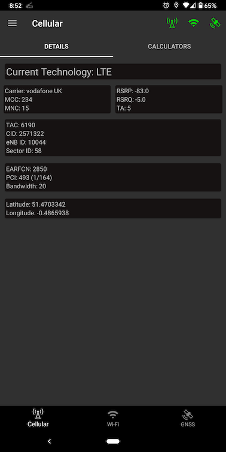
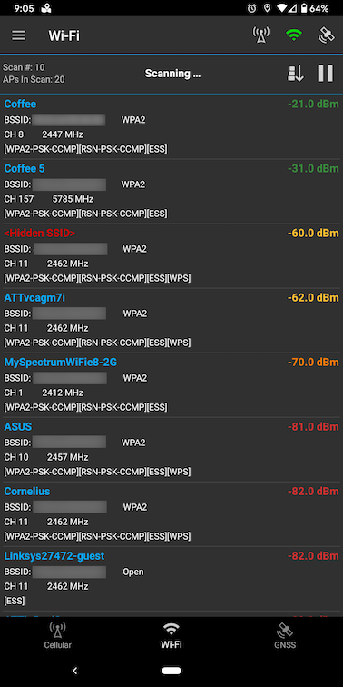
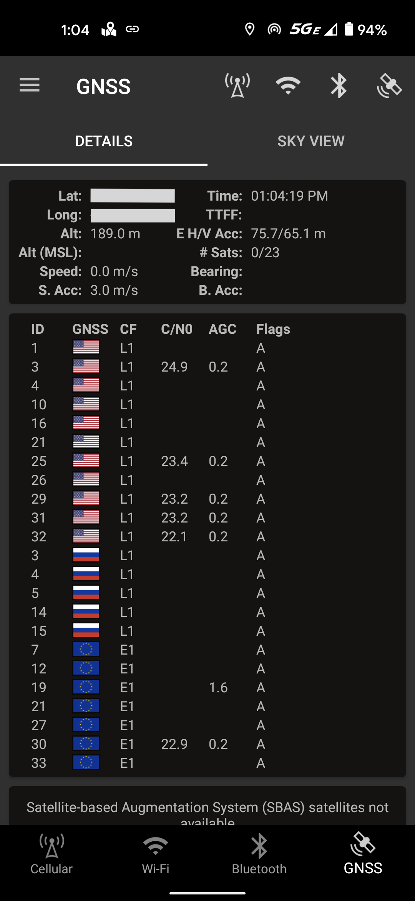

# Network Survey Android App

[](https://travis-ci.com/github/christianrowlands/android-network-survey)
[](https://github.com/christianrowlands/android-network-survey/blob/develop/LICENSE)

The Network Survey Android App provides a basic survey capability for Cellular networks, Wi-Fi
networks and GNSS constellations.  
For cellular data, in its current state it can be used to examine the network details of the current
LTE serving cell, and log GSM, CDMA, UMTS, LTE, and NR records to a GeoPackage file. Wi-Fi survey
records can also be logged to a GeoPackage file, and the current list of Wi-Fi networks in range is
displayed in the UI. The App also supports connecting to a remote gRPC server and live streaming the
cellular and Wi-Fi records. For GNSS data, it can display the latest information about the satellite
vehicles and also log the information to a GeoPackage file.





## Getting Started

To build and install the project follow the steps below:

    1) Clone the repo.
    2) Open Android Studio, and then open the root directory of the cloned repo.
    3) Connect an Android Phone (make sure debugging is enabled on the device).
    4) Install and run the app by clicking the "Play" button in Android Studio.

### Run Tests

> NOTE: This requires a connected device (physical device or Android Emulator)

```
./gradlew connectedAndroidTest
```

### Prerequisites

Install Android Studio to work on this code.

## Built With

* [GeoPackage Android](https://github.com/ngageoint/geopackage-android) - The logging file standard
  and library

## Available At

[The Google Play Listing for this app](https://play.google.com/store/apps/details?id=com.craxiom.networksurvey)

[IzzyOnDroid F-Droid](https://apt.izzysoft.de/fdroid/index/apk/com.craxiom.networksurvey)

## gRPC Survey Record Streaming

The Network Survey app supports streaming GSM, CDMA, UMTS, LTE, and 802.11 survey records to a gRPC
server. More specifically,
the [Network Survey Messaging](https://github.com/christianrowlands/network-survey-messaging)
library can be used to stand up a gRPC server. From there it is up to the implementation to handle
the incoming survey messages.

## MQTT Broker Survey Record Streaming

Currently, GSM, CDMA, UMTS, LTE, NR, 802.11, Bluetooth and GNSS survey records are sent to a
connected MQTT broker. They are published on the following MQTT Topics:

* gsm_message
* cdma_message
* umts_message
* lte_message
* nr_message
* 80211_beacon_message
* bluetooth_message
* gnss_message

There is also a DeviceStatus and a PhoneState message that is published on
the `device_status_message` topic.

The MQTT Broker connection supports both plain text and TLS/SSL connections.

The survey messages are sent in JSON format following the protobuf definitions from
the [Network Survey Messaging](https://github.com/christianrowlands/network-survey-messaging)
library. [The API documentation is published to a web page here](https://messaging.networksurvey.app/)
.

## Changelog

##### [1.5.1](https://github.com/christianrowlands/android-network-survey/releases/tag/v1.5.1) - 2021-11-30

* Fixed a bug where incorrect 5G NR values were being reported.
* Updated to NS Messaging API version 0.8.0.
* Added support for setting the EcNo field for UMTS.

##### [1.5.0](https://github.com/christianrowlands/android-network-survey/releases/tag/v1.5.0) - 2021-09-13

* Added support for 5G New Radio (NR) survey.
* Added the AGC to the GNSS Status Display.
* Added a location accuracy field to each message (both GeoPackage and MQTT).

##### [1.4.3](https://github.com/christianrowlands/android-network-survey/releases/tag/v1.4.3) - 2021-08-08

* Fixed several bugs that could cause the app to crash in various scenarios.

##### [1.4.2](https://github.com/christianrowlands/android-network-survey/releases/tag/v1.4.2) - 2021-07-08

* Fixed a bug where the survey record queue would fill up and reject new records.
* Added the missionId and recordNumber fields to the Phone State message.
* Added support for logging the Phone State message to GeoPackage.

##### [1.4.1](https://github.com/christianrowlands/android-network-survey/releases/tag/v1.4.1) - 2021-06-28

* Fixed a bug where the MQTT connection would not reconnect when the phone dropped its data
  connection.

##### [1.4.0](https://github.com/christianrowlands/android-network-survey/releases/tag/v1.4.0) - 2021-06-11

* Fixed a bug where permissions were not being requested on Android 11.
* Added support for streaming Phone State messages out over MQTT. The Phone State message is used to
  report some basic information about the phone such as the current serving cell, current
  technology, if a SIM is present, etc.
* Updated the default Bluetooth scan interval to 30 seconds because I kept seeing messages that the
  previous scan was not done when using 15 and 20 seconds as defaults.
* Updated the default GNSS scan interval to 10 seconds since 8 seconds seemed too often.
* Added a Device Model field to the GNSS and Device Status messages.
* Added the Mission ID field to the GeoPackage files.
* Improved the UX for error scenarios when connecting to an MQTT broker (e.g. notify the user of
  invalid username/password).
* Fixed the GNSS Raw Measurements information link.

##### [1.3.0](https://github.com/christianrowlands/android-network-survey/releases/tag/v1.3.0) - 2021-05-18

* Updated the permissions dialog with some extra details on why the background location is needed.

##### [1.2.0](https://github.com/christianrowlands/android-network-survey/releases/tag/v1.2.0) - 2021-04-29

* Improved the MQTT Connection stability and fixed a few bugs that resulted in the app crashing.

##### [1.1.0](https://github.com/christianrowlands/android-network-survey/releases/tag/v1.1.0) - 2021-04-15

* Added support for streaming a Device Status message over an MQTT connection.
* Fixed the logging buttons on the toolbar so that they are always visible.

##### [1.0.0](https://github.com/christianrowlands/android-network-survey/releases/tag/v1.0.0) - 2021-01-20

* Added Bluetooth survey support for streaming over an MQTT connection and logging to a GeoPackage
  file.
* Added a Bluetooth survey UI for viewing all Bluetooth devices within range.
* Updated the Wi-Fi Status UI to reflect when Wi-Fi is disabled.

##### [0.4.0](https://github.com/christianrowlands/android-network-survey/releases/tag/v0.4.0) - 2020-11-17

* Fixed a bug that caused an app crash if it was opened, hidden, and reopened in short sequence.
* Fixed a bug where the app would crash if trying to enable GNSS logging with location services
  turned off.
* Added a survey log file rollover option to prevent the log file from growing too large.
* Added support for streaming GNSS records over an MQTT connection.
* Added a dialog to warn the user if the device does not support raw GNSS measurements.
* Added several more app restrictions to allow more control when the device is under MDM.

##### [0.3.0](https://github.com/christianrowlands/android-network-survey/releases/tag/v0.3.0) - 2020-10-01

* Reduced the GNSS GeoPackage file size by around 100x.
* Changed the GNSS GeoPackage table format.
* Added scan rate interval user preferences for Cellular, Wi-Fi, and GNSS.

##### [0.2.1](https://github.com/christianrowlands/android-network-survey/releases/tag/v0.2.1) - 2020-08-21

* Updated the device time field to use RFC 3339 instead of Unix Epoch time.
* Fixed a bug where the connection would not stop if the server shutdown before the client.

##### [0.2.0](https://github.com/christianrowlands/android-network-survey/releases/tag/v0.2.0) - 2020-08-11

* Updated to use the new Network Survey Messaging connection library.
* Updated to use the new Network Survey Messaging format for the MQTT messages.

##### [0.1.5](https://github.com/christianrowlands/android-network-survey/releases/tag/v0.1.5) - 2020-07-02

* Fixed a bug where the MDM override setting was not being saved.

##### [0.1.4](https://github.com/christianrowlands/android-network-survey/releases/tag/v0.1.4) - 2020-07-02

* Changed the TLS Enabled MDM setting from a string to a boolean.

##### [0.1.3](https://github.com/christianrowlands/android-network-survey/releases/tag/v0.1.3) - 2020-06-30

* Added the user entered device name to the outgoing MQTT messages.
* When the MQTT connection is configured via MDM, the configuration is now displayed in the MQTT
  connection UI.
* Added a user preference to auto start the MQTT connection when the phone is booted.

##### [0.1.2](https://github.com/christianrowlands/android-network-survey/releases/tag/v0.1.2) - 2020-06-03

* Wi-Fi beacon survey records can now be logged to a GeoPackage file, and sent over the connections.
* Added support for displaying the list of visible Wi-Fi networks.
* Improved the stability of the MQTT connection.
* The app's version number is now displayed in the navigation drawer.

##### [0.1.1](https://github.com/christianrowlands/android-network-survey/releases/tag/v0.1.1) - 2020-05-08

* Added support for connecting to an MQTT broker and streaming cellular survey records.
* Added support for allowing the MQTT broker connection information to be set via MDM.
* Fixed a bug that caused the calculator text field to be covered on screens with low resolution and
  large font.

##### [0.1.0](https://github.com/christianrowlands/android-network-survey/releases/tag/release-0.1.0) - 2020-03-24

* Added support for logging GNSS information to a GeoPackage file.

##### [0.0.9](https://github.com/christianrowlands/android-network-survey/releases/tag/release-0.0.9) - 2020-01-10

* Moved the file logging and connection logic to foreground services to prevent the Android System
  from stopping them.
* The connection now supports sending GSM, CDMA, UMTS, and LTE survey records.
* Added a navigation drawer and put the calculators and connection in it.
* Added a settings UI.
* Other general improvements.

## Contact

* **Christian Rowlands** - [Craxiom](https://github.com/christianrowlands)
