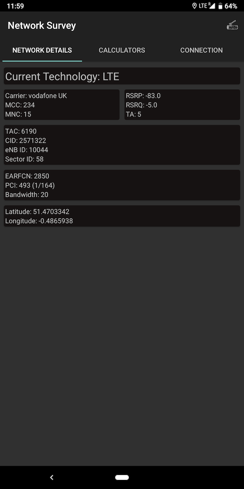

# Network Survey Android App

The Network Survey Android App provides a basic survey capability for LTE networks.  In its current state, it can be 
used to examine the network details of the current LTE serving cell, and log GSM, CDMA, UMTS, and LTE records to a 
GeoPackage file.  The App also supports connecting to a remote gRPC server and live streaming the LTE records.

## Getting Started

To build and install the project follow the steps below:

    1) Clone the repo.
    2) Open Android Studio, and then open the root directory of the cloned repo.
    3) Connect an Android Phone (make sure debugging is enabled on the device).
    4) Install and run the app by clicking the "Play" button in Android Studio.

### Prerequisites

Install Android Studio to work on this code.

## Built With

* [GeoPackage Android](https://github.com/ngageoint/geopackage-android) - The logging file standard and library

## Google Play Listing

[The Google Play Listing for this app](https://play.google.com/store/apps/details?id=com.craxiom.networksurvey)

## Authors

* **Christian Rowlands** - *Initial work* - [Craxiom](https://github.com/craxiom)
