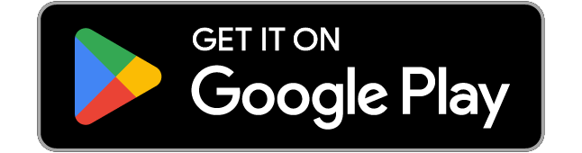
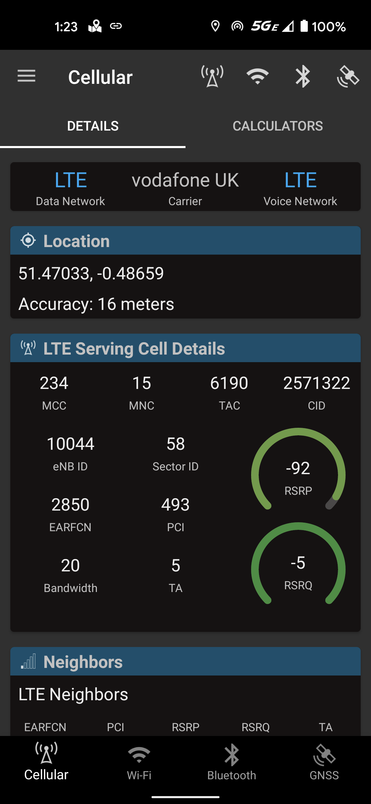
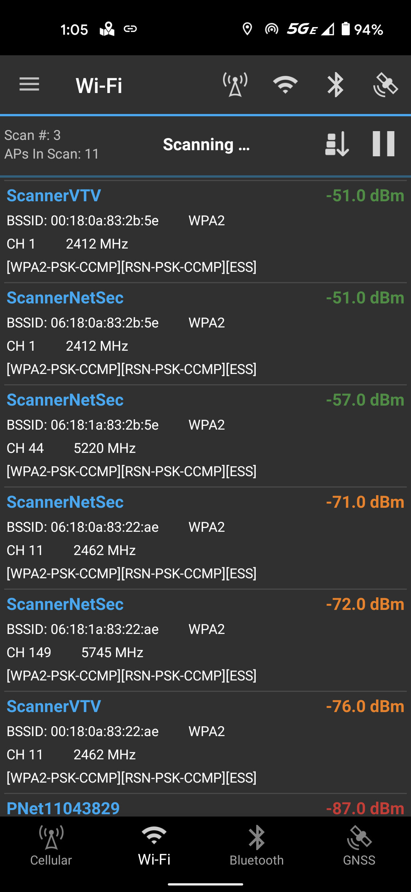

# Network Survey Android App


[](https://github.com/christianrowlands/android-network-survey/blob/develop/LICENSE)


<p align="center">
  <a href="https://play.google.com/store/apps/details?id=com.craxiom.networksurvey">
    
  </a>
  <a href="https://apt.izzysoft.de/fdroid/index/apk/com.craxiom.networksurvey">
    
  </a>
</p>

The Network Survey Android App provides a basic survey capability for logging and analyzing
Cellular networks, Wi-Fi networks, Bluetooth Devices, and GNSS constellations. Capture detailed
records of signal strength, network information, and device data. All data can be conveniently
logged to GeoPackage or CSV files for offline analysis. Alternatively, choose to live stream the
data via MQTT or gRPC protocols for real-time monitoring and integration with other systems.

The Network Survey user manual can be found [here](https://networksurvey.app/manual).

<p align="center">
  
  
  
  
</p>

## CDR Log Files

**Introduction:**
The Network Survey app now includes a feature for logging Call Detail Records (CDR). This
functionality provides insight into various interactions your phone has with the cellular network.

**What is a CDR?**
A Call Detail Record (CDR) is a data record that documents specific interactions a phone has with
the cellular network. These interactions include phone calls, SMS messages, and changes in cell
tower connections.

**Use Cases:**

- **Monitoring Network Activity:** Record and review your phone's cellular network interactions.
- **Educational Insight:** Gain an understanding of how cellular networks operate.
- **Privacy Monitoring:** Check if your phone is connecting to unexpected cell towers.

**Note on Feature Limitations:**

- The regular version of Network Survey does not log SMS events in the CDR due to Google Play's
  policy against apps requesting full SMS permissions.
- Logging the "other" phone number associated with call events is also not supported in the regular
  version.

**Alternative Version with Extended Features:**
If you're interested in CDR logging that includes SMS events and call details:

1. **Install from Source:** You can build and install the app using the source code available in
   this repository.
2. **Download Pre-Built APK:** Access the latest "*cdr-release.apk" under the latest release on
   our [GitHub Releases page](https://github.com/christianrowlands/android-network-survey/releases).
3. **IzzyOnDroid:** Install
   from [IzzyOnDroid](https://apt.izzysoft.de/fdroid/index/apk/com.craxiom.networksurvey).

## Tracking And Privacy

The version of this app on the Play Store has Firebase Crashlytics and Analytics set up. This means
that app crash logs and analytics are sent off the device to Firebase. If you don't want to
participate in this type of tracking then you have three options.

1. Install the app
   from [IzzyOnDroid](https://apt.izzysoft.de/fdroid/index/apk/com.craxiom.networksurvey).
2. Install the app from the source code in this repo specifying the CDR build variant.
3. Install the app using the CDR APK from
   the [Release Page](https://github.com/christianrowlands/android-network-survey/releases).

The [privacy policy for this app](privacy_policy.md) contains more information on the data that is
sent to Firebase for the Google Play Store version of this app.

## Getting Started

To build and install the project follow the steps below:

    1) Clone the repo.
    2) Open Android Studio, and then open the root directory of the cloned repo.
    3) Connect an Android Phone (make sure debugging is enabled on the device).
    4) Install and run the app by clicking the "Play" button in Android Studio.

If you want to build using the command line, the apk can be built and installed using the following
commands. Make sure your phone is connected to your computer before running the install command.

There are two build variants available for this app. The default build variant is the regular
version of the app which is the "Google Play" version. As noted in the privacy section, the
"Google Play" version has Firebase Crashlytics and Analytics enabled. The second build variant is
the "CDR" version. The "CDR" version does not have Firebase Crashlytics and Analytics enabled, and
it has the extended CDR logging features (as discussed above).

### Build and Install the Regular Version

> NOTE: If building on Windows, replace `./gradlew` with `gradlew`

```shell
./gradlew assembleRegularDebug
./gradlew installRegularDebug
```

### Build and Install the CDR Version

```shell
./gradlew assembleCdrDebug
./gradlew installCdrDebug
```

### Run Tests

> NOTE: This requires a connected device (physical device or Android Emulator)

```
./gradlew connectedAndroidTest
```

### Prerequisites

Install Android Studio to work on this code.

## gRPC Survey Record Streaming

The Network Survey app supports streaming GSM, CDMA, UMTS, LTE, and 802.11 survey records to a gRPC
server. More specifically,
the [Network Survey Messaging](https://github.com/christianrowlands/network-survey-messaging)
library can be used to stand up a gRPC server. From there it is up to the implementation to handle
the incoming survey messages.

If you want to see how to use the generated Go code to create a gRPC server, check out the code at 
https://github.com/christianrowlands/ns-messaging-go-grpc-server

The server does not do anything useful, but serves as an example of how one might be created in GoLang.

## MQTT Broker Survey Record Streaming

Currently, GSM, CDMA, UMTS, LTE, NR, 802.11, Bluetooth and GNSS survey records are sent to a
connected MQTT broker. They are published on the following MQTT Topics:

* gsm_message
* cdma_message
* umts_message
* lte_message
* nr_message
* 80211_beacon_message
* bluetooth_message
* gnss_message

There is also a DeviceStatus and a PhoneState message that is published on
the `device_status_message` topic.

The MQTT Broker connection supports both plain text and TLS/SSL connections.

The survey messages are sent in JSON format following the protobuf definitions from
the [Network Survey Messaging](https://github.com/christianrowlands/network-survey-messaging)
library. [The API documentation is published to a web page here](https://messaging.networksurvey.app/)
.

QR Code for MQTT Broker connection setting needs to provide a JSON string with the following fields.

The `mqtt_client` field is optional and will default to the App's auto-generated value.

The `mqtt_topic_prefix` field is used to prefix the MQTT topics that the survey records are
published
to. The default topics are listed above (e.g. `lte_message`), but if you want to add a custom
prefix,
you can use the `mqtt_topic_prefix` field to change the topic to something like
`my/custom/topic/lte_message` by setting the value to `"mqtt_topic_prefix": "my/custom/topic/"`
(notice the trailing slash).

```json
{
  "mqtt_host": "cloud.mymqttserver.com",
  "mqtt_port": 8883,
  "mqtt_tls": true,
  "mqtt_client": "aclient",
  "mqtt_username": "auser",
  "mqtt_password": "apassword",
  "mqtt_topic_prefix": "my/custom/topic/path/",
  "cellular_stream_enabled": true,
  "wifi_stream_enabled": true,
  "bluetooth_stream_enabled": true,
  "gnss_stream_enabled": true,
  "device_status_stream_enabled": true
}
```

## Intent API

The Network Survey app supports an Intent API that allows other apps to start and stop a survey. The
Intent API is documented on the [Intent API website](https://www.networksurvey.app/intent-api).

## Credits and Acknowledgements

### Credits

This project uses elements from the **[GPSTest Android app](https://github.com/barbeau/gpstest)**,
specifically the GPS user interface components. We appreciate the GPSTest app for making these
resources available and acknowledge their contribution to the open source community.

### Acknowledgements

We would like to express our gratitude to all the contributors who have dedicated their time and
skills to this project. Your contributions have been invaluable to the development and success of
this application.

Thank you to:

<a href="https://github.com/christianrowlands/android-network-survey/graphs/contributors">
  
</a>

Made with [contrib.rocks](https://contrib.rocks).

Your commitment and hard work are sincerely appreciated.

## Changelog

See the change log for details about each release: [`CHANGELOG.md`](CHANGELOG.md)

## Contact

* **Christian Rowlands** - [Craxiom](https://github.com/christianrowlands)
